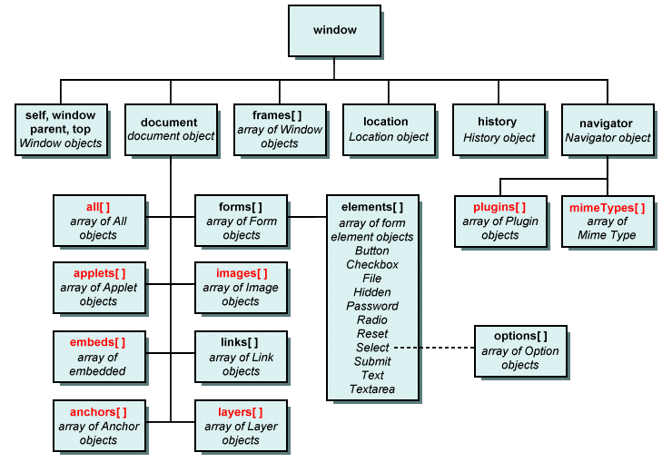
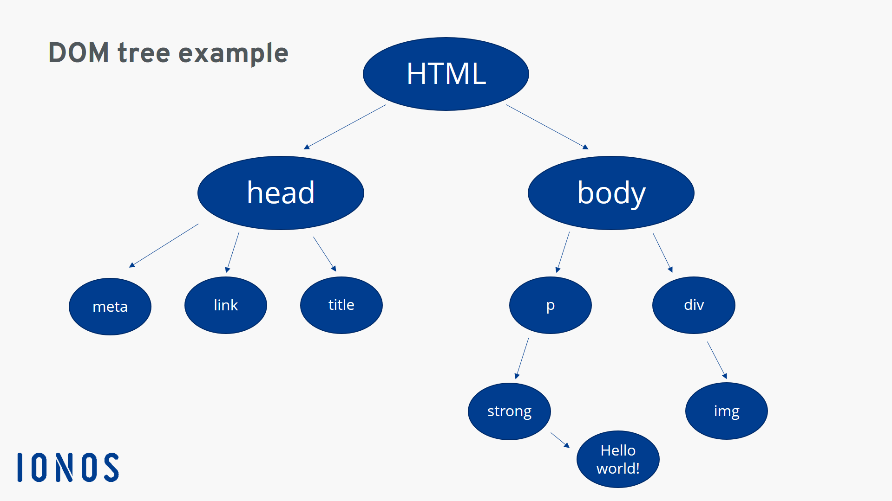
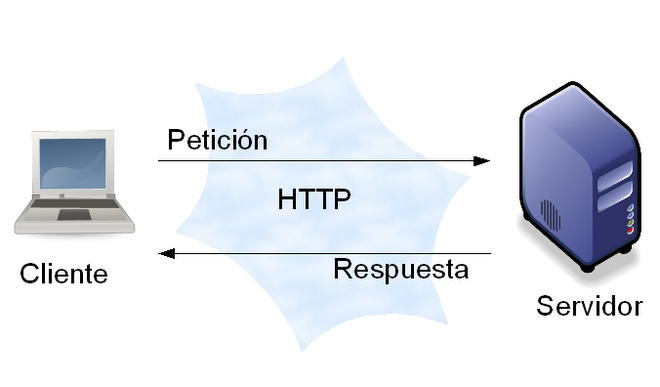
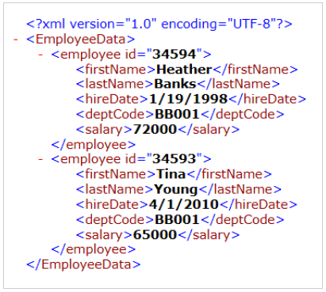
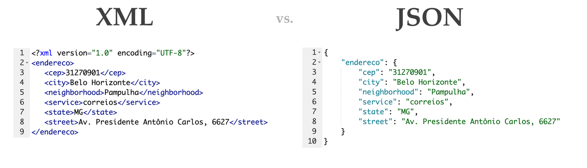
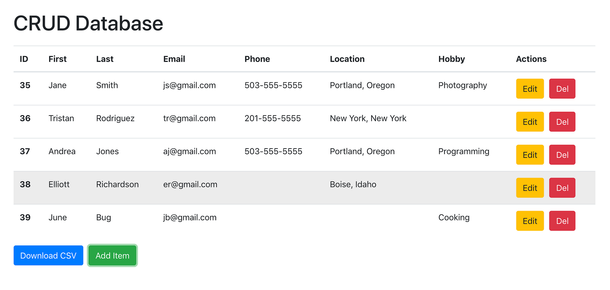

# Empezar un proyecto con VITE

```sh
npm create vite@lastest ./ # -> vanilla -> javascript
npm create vite@lastest ./ -- --template vanilla
```

## Instalando dependencias

```sh
npm install # npm i
```

## Arrancado el servidor de desarrollo

```sh
npm run dev
```

## Detengo el servidor de desarrollo

(Ctrl) + C 


# Instalando bootstrap en nuestro proyecto

```sh
npm i bootstrap
npm i bootstrap@5.3.3
```

```json
"dependencies": {
    "bootstrap": "^5.3.3"
}
```

## Configurando Bootstrap

> style.css

```css
@import "bootstrap";
```

> main.js

```sh
import * as bootstrap from 'bootstrap'
```


# Instalando una biblioteca, librería o paquete en modo desarrollo

```sh
npm i <paquete> -D # Instalo un paquete en modo desarrollo.
```

# Para subir el sitio a un hosting (netlify)

1 . Detengo el servidor de desarrollo 

(Ctrl) + C

2. Genero la carpeta dist

```sh
npm run build
```

3. Arrastro la carpeta **dist** a netlify

# WINDOW (BOM)

<https://developer.mozilla.org/es/docs/Web/API>

# BOM y DOM



# DOM (Árbol)



# Protocolo HTTP



# XML




# XML vs JSON



# CRUD




# Trabajando con JSON-SERVER
Es una REST API para pruebas y trabajo local

<https://github.com/typicode/json-server>
<https://www.npmjs.com/package/json-server>

1. Instalando json-server

```sh
npm i json-server@0.17.4 -D # -D -> Dependencia de desarrollo
```

2. Agrego el archivo db.json

```sh
mkdir data
touch data/db.jon
```
> db.json

```json
{
  "posts": [
    { "id": 1, "title": "json-server", "author": "typicode" }
  ],
  "comments": [
    { "id": 1, "body": "some comment", "postId": 1 }
  ],
  "profile": { "name": "typicode" }
}
```

3. Agregar en el package.json. El scripts

> package.json

```json
"scripts": {
    "dev": "vite",
    "server": "json-server --watch data/db.json --port 8080" // <---- script a agregar
},
```

4. Inicio el servidor
Abro una nueva consola

```sh
npm run server
```

5. Detener el servidor

(Ctrl) + C

## Subir el proyecto a Netlify

1. Detengo el servidor de desarrollo

(Ctrl) + C

2. Hago el build (Creo la carpeta de distribución)

```sh
npm run build
```

3. Proceso de previsualización de la carpeta dist

```sh
npm run preview
```

4. Debería subir eso a Netlify

Arrastro y suelto la carpeta en netlify

